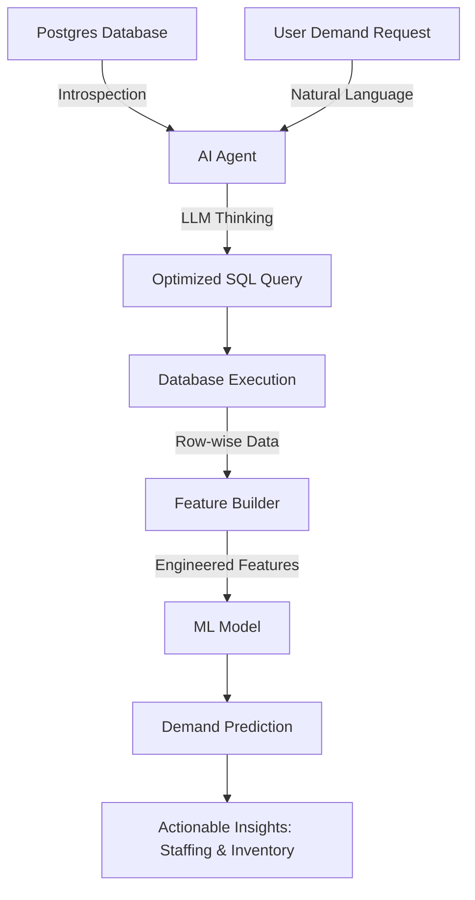
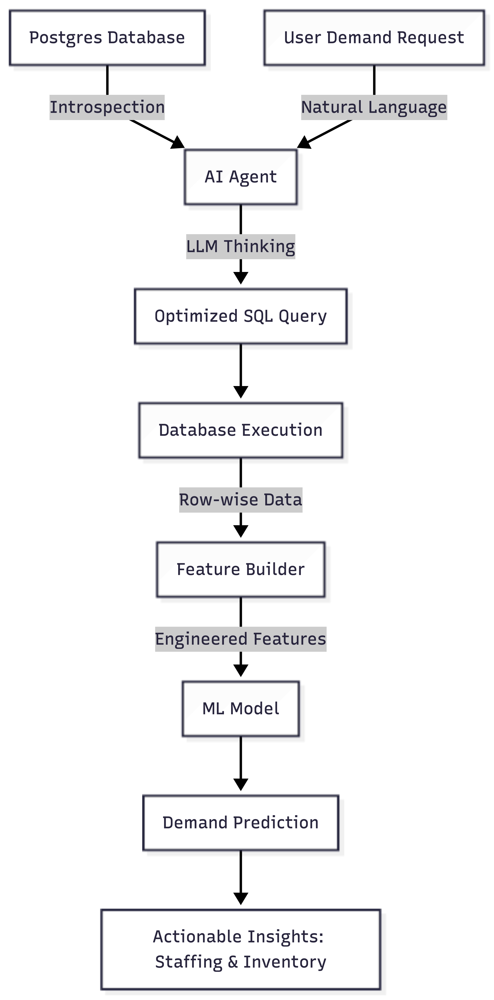

# Production-Level POC: AI-Driven Demand Prediction Pipeline

This project demonstrates a production-grade Proof of Concept (POC) where an **AI Agent** act as an intelligent bridge between a **PostgreSQL Sandbox** and an **ML Prediction Model**. 

## 🏗 Architecture Overview

The pipeline follows a specific flow to ensure the ML model receives exactly the data it needs, without manual human intervention for query writing:



---

## 🛠 Component Breakdown

### 1. The Sandbox Database (PostgreSQL)
We deployed a containerized PostgreSQL instance using **Docker**. 


- **Tables:**
    - `restaurant_sales`: Historical transaction data including weather and seasonal metadata.
    - `labour_attendance`: Staff check-in/out records and roles.
    - `table_reservations`: Future and past bookings with party sizes.
- **Port:** Hosted on `5433` to prevent local conflicts.

### 2. Intelligent Data Seeding
To make the POC realistic, we built a **Dummy Data Generator** using the `Faker` library. It simulated **90 days** of operation, creating meaningful correlations between time of day (Lunch/Dinner peaks), weather conditions, and seasonal trends.

### 3. The AI Agent (`MLAgent`)
Powered by **Groq (Llama-3.3-70b-versatile)**, this is the brain of the system.
- **Dynamic Schema Context:** Instead of being hardcoded, the agent introspects the database to understand the tables and columns.
- **NL to SQL:** It translates high-level requests (e.g., *"Predict demand for tomorrow's rainy dinner"*) into complex PostgreSQL queries involving JOINs, aggregations, and DATE filtering.
- **Precision Filter:** The agent is instructed to fetch "just the right amount of data"—preventing data bloat for the ML model while ensuring critical features aren't missed.

### 4. Feature Builder & ML Model
- **Feature Builder:** Automatically cleans the SQL result, handles missing values, and prepares the data for inference.
- **Dummy ML Model:** A placeholder module that simulates predictive analysis, outputting specific metrics like **Expected Customer Count**, **Recommended Staffing**, and **Inventory Adjustments**.

---

## 🚀 Key Achievements

- **Automated Data Retrieval:** No human needs to write SQL. The agent understands the database relationship between personnel, reservations, and sales.
- **Contextual Intelligence:** The agent filters historical data based on current conditions (Rainy weather, Summer season) to provide the model with the most relevant training/inference context.
- **Zero-Trust Execution:** The system provides a template for how LLMs can interact with production databases securely by generating queries that are strictly validated against a schema context.
- **Actionable Output:** The pipeline doesn't just show data; it ends with actionable business insights (e.g., *"Recommend 6 staff members and 1.2x inventory increase"*).

---

## 📖 How to Run the POC

1. **Start Database:**
   ```bash
   docker-compose up -d
   ```
2. **Execute Agent:**
   ```bash
   source venv/bin/activate
   python agent.py
   ```

3. **Check Data (DBeaver):**
   Connect to `localhost:5433` (DB: `demand_db`, User: `demand_user`) to view the 3 core tables.
